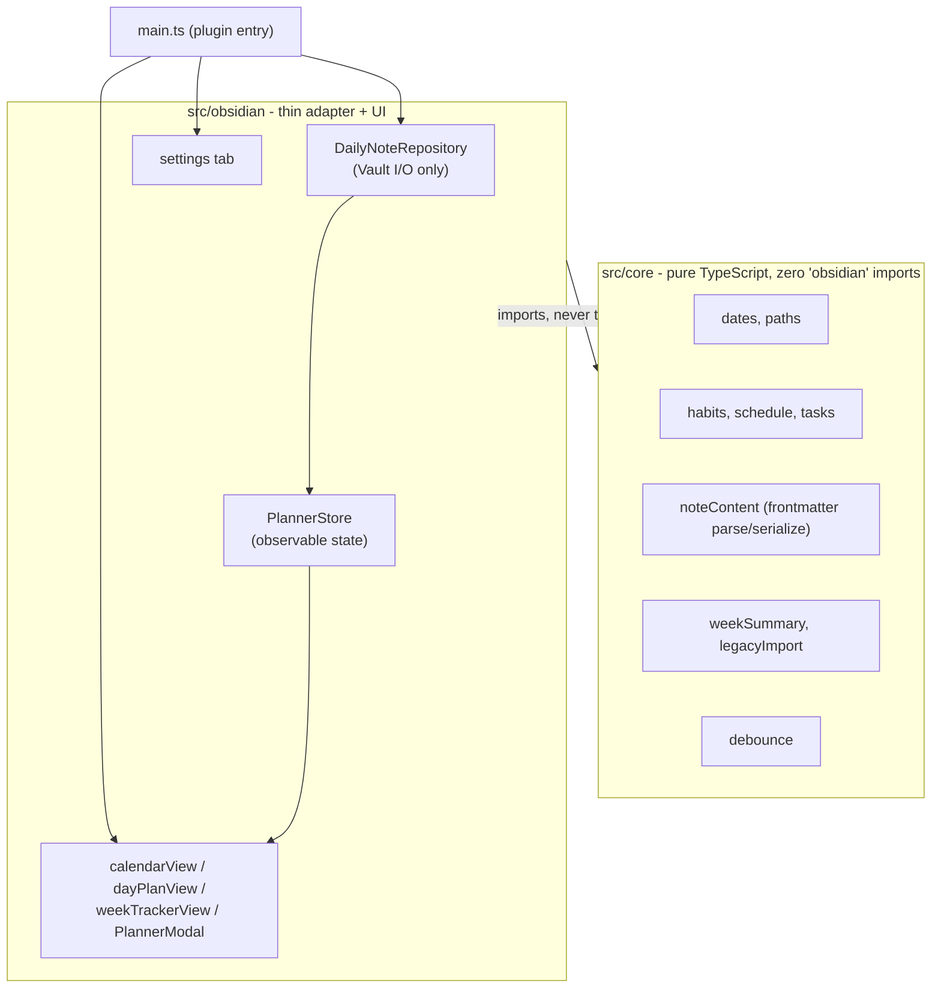

# Daily Planner Plugin

An [Obsidian](https://obsidian.md) plugin for planning your day: a calendar, a daily
task checklist and schedule, and a weekly habit tracker - all backed by plain
Markdown notes in your vault.

## Usage

Click the calendar-with-checkmark ribbon icon (or run **Add task for today** /
**Migrate legacy Daily Planner notes** from the command palette) to open the
**Daily Planner** panel:

- **Calendar** - a month grid with prev/next navigation. Days with content are
  marked with a dot; click a day to select it.
- **Day plan** - the selected day's task checklist and schedule, each with an
  inline form to add a new entry.
- **Week tracker** - sticked to the bottom, always shows the *current* week's
  task completion and habit grid, independent of whichever day is selected
  above.

Each day is stored as its own note at
`<root folder>/Daily/YYYY/MM/YYYY-MM-DD.md`, with habits and schedule in the
frontmatter and tasks as a checklist in the body:

```yaml
---
habits:
  legs: true
  back: false
schedule:
  - time: "09:00"
    title: Team sync
---
# 19 August 2026

- [x] Do task A
- [ ] Do task B
```

The habit list and root folder are configurable from the plugin's settings tab.

## Hiding daily notes from the file explorer

The plugin deliberately stores one Markdown file per day rather than one big
file, so Dataview/Tasks queries, backlinks to a specific day, and per-day git
history all keep working normally. The only downside is that the file
explorer's tree can look cluttered with a folder nobody actually browses by
hand, since all interaction goes through the **Daily Planner** panel.

The settings tab has an optional toggle, **"Hide daily notes from the file
explorer"** (off by default), that adds `<root
folder>/Daily` to Obsidian's own **Excluded files** list (Settings → Files
and Links → Excluded files) - the same global mechanism you'd configure by
hand. Turning it off removes exactly that one entry, leaving anything else
already in your excluded-files list untouched. In both cases the note files
themselves are never moved, renamed, or deleted - only their visibility in
the explorer and search changes, and the panel's own access to them is
unaffected.

This uses an internal Obsidian API (`vault.getConfig`/`setConfig`) that isn't
part of the documented plugin API and could change in a future Obsidian
release; the plugin checks it's available before touching anything, and if
it ever isn't, the toggle shows a notice asking you to add the folder to
Excluded files by hand instead - which you can always do regardless, as a
manual alternative that doesn't depend on this plugin at all.

## Architecture

The codebase is split into two layers:



- **`src/core/`** has no dependency on the `obsidian` package and is fully
  unit-tested without mocks (see [Tests](#tests)). It owns all business logic:
  date/week math, habit and schedule normalization, task parsing and the
  unfinished-task migration, week aggregation, legacy-data parsing, and
  frontmatter parsing/serialization. An ESLint rule
  (`no-restricted-imports` on `src/core/**`) enforces the boundary in CI -
  core importing from `obsidian` or `src/obsidian` is a lint error, not just a
  convention.
- **`src/obsidian/`** only reads/writes the Vault and renders UI; it contains
  no business logic itself, just calls into `src/core`.
  - `DailyNoteRepository` reads/writes daily notes. Frontmatter is parsed from
    plain file text (`core/noteContent`) rather than through
    `metadataCache`/`processFrontMatter`, so reads never race a
    not-yet-reindexed cache after a write. Writes are debounced per file
    (250ms, coalescing rapid checkbox/habit toggles) and flushed immediately
    when the modal closes or the plugin unloads.
  - `PlannerStore` is a small hand-rolled observable store (not a framework -
    see below) holding the modal's state. Each of the three UI zones
    subscribes and re-renders only when the state keys it cares about change;
    in particular the week tracker never re-renders when only the selected
    day changes.

**Known limitation:** frontmatter is fully regenerated on every write (not a
line-by-line patch), so hand-added YAML comments in a daily note won't survive
an edit made through the plugin. Acceptable since these are plugin-owned,
plugin-generated files.

### Why not Svelte?

Obsidian plugins commonly reach for Svelte (via `esbuild-svelte`) for
interactive UI. Here the UI is one modal with three zones and no reusable
components across views, so a compiler, a new file type, and a framework
dependency would add real build complexity for a problem a ~150-line
hand-rolled store already solves cleanly - and the store itself is testable
without any DOM.

## Tests

`src/core/` has Vitest coverage with no Obsidian mocks (the core/adapter split
makes this possible): date/week math including month- and year-boundary
weeks, frontmatter parse/serialize round-trips and graceful fallback on
missing/corrupt frontmatter, habit and schedule normalization, the
unfinished-task migration, and legacy-data parsing. `src/obsidian/` is
intentionally not unit-tested - a realistic Vault/MetadataCache fake would be
substantial for low return - and should be exercised manually inside a real
vault instead.

```bash
npm test        # run once
npm run test:watch
```

## Development

```bash
npm install
npm run dev      # esbuild watch build
npm run lint
npm run typecheck
npm run build    # production build -> main.js
```

CI (`.github/workflows/ci.yml`) runs lint, typecheck, tests, and the
production build on every push/PR.

## Installing into a vault

Copy `manifest.json`, `main.js`, and `styles.css` from a build/release into
`<vault>/.obsidian/plugins/daily-planner-plugin/` and enable the plugin from
Obsidian's Community Plugins settings. Publishing to the official Community
Plugins directory is a manual review process via a PR to
[obsidianmd/obsidian-releases](https://github.com/obsidianmd/obsidian-releases)
and isn't automated here.

## License

MIT - see [LICENSE](LICENSE).
