# SummaryManager - Руководство по использованию

## 🎯 Описание

`SummaryManager` - это класс для создания сводок и визуализации данных о тренировках из Health Tracker файлов. Он автоматически сканирует папки с файлами тренировок и создает красивые диаграммы и сводки.

## 🏗️ Структура папок

```
Daily Planner/
├── Health Tracker/
│   ├── 📅 July 2025/
│   │   ├── 1 - 6.md
│   │   ├── 7 - 13.md
│   │   ├── 14 - 20.md
│   │   ├── 21 - 27.md
│   │   └── 28 - 31.md
│   └── 📅 August 2025/
│       ├── 1 - 7.md
│       └── ...
├── Summary.md
└── Chart.html
```

## 🚀 Основные методы

### 1. `generateWeeklySummary()`
Создает основную сводку в файле `Summary.md` с тремя типами визуализации:
- **Mermaid диаграмма** - интерактивная столбчатая диаграмма
- **Сводная таблица** - детальная таблица с данными по дням
- **ASCII график** - текстовое представление для совместимости

```typescript
await summaryManager.generateWeeklySummary();
// Создает файл: Daily Planner/Summary.md
```

### 2. `generateTestSummary()`
Создает тестовую сводку с образцовыми данными для демонстрации:

```typescript
await summaryManager.generateTestSummary();
// Создает файл: Daily Planner/Test Summary.md
```

### 3. `generateHtmlChartFile()`
Создает HTML файл с Chart.js диаграммой для внешнего просмотра:

```typescript
await summaryManager.generateHtmlChartFile();
// Создает файл: Daily Planner/Chart.html
```

### 4. `generateSummary(trackerFilePath)`
Создает сводку по конкретному файлу тренировок:

```typescript
await summaryManager.generateSummary("Daily Planner/Health Tracker/📅 July 2025/1 - 6.md");
```

## 📊 Типы визуализации

### Mermaid Диаграмма

```mermaid
xychart-beta
    title "Weekly Health Habits Summary"
    x-axis [Monday, Tuesday, Wednesday, Thursday, Friday, Saturday, Sunday]
    y-axis "Number of Exercises" 0 --> 5
    bar [1, 0, 1, 0, 1, 1, 0] 
    bar [1, 1, 0, 1, 1, 1, 1] 
    bar [0, 1, 1, 1, 1, 0, 1] 
```


### Сводная таблица
| Muscle Group | Monday | Tuesday | Wednesday | Thursday | Friday | Saturday | Sunday | Total |
|-------------|--------|---------|-----------|----------|--------|----------|--------|-------|
| **Glutes**  | **1**  | 0       | **1**     | 0        | **1**  | **1**    | 0      | **4** |
| **Legs**    | **1**  | **1**   | 0         | **1**    | **1**  | **1**    | **1**  | **6** |

### ASCII График
```
Exercises per day (0-5):
Day:    Mon  Tue  Wed  Thu  Fri  Sat  Sun
        ----------------------------------------
Level 5:      ████      ████      ████      
Level 4: ████ ████ ████ ████ ████ ████ ████
Level 3: ████ ████ ████ ████ ████ ████ ████
Level 2: ████ ████ ████ ████ ████ ████ ████
Level 1: ████ ████ ████ ████ ████ ████ ████
        ----------------------------------------
        Mon  Tue  Wed  Thu  Fri  Sat  Sun
```

## 🎨 Цветовая схема

| Группа мышц | Цвет (HEX) | Описание |
|-------------|------------|----------|
| Glutes      | #FF69B4    | Розовый  |
| Legs        | #4169E1    | Синий    |
| Back        | #FFD700    | Желтый   |
| Brists      | #20B2AA    | Бирюзовый|
| Shoulders   | #9370DB    | Фиолетовый|
| Jogging     | #FFA500    | Оранжевый|
| Yoga        | #808080    | Серый    |

## 📁 Парсинг файлов

### Формат файла Health Tracker
===========================================================
# Health Tracker - 24 July 2025

| Weekdays           | Mo | Tu | We | Th | Fr | Sa | Su |
| ------------------ |----|----|----|----|----|----|----|
| Daily Habits Track | 24 | 25 | 26 | 27 | 28 | 29 | 30 |
| Glutes            | <input type="checkbox" checked> | <input type="checkbox"> | ... |
| Legs              | <input type="checkbox"> | <input type="checkbox" checked> | ... |

===========================================================

### Логика парсинга
1. **Поиск таблицы**: Ищет строку с "Weekdays"
2. **Извлечение данных**: Читает строки с группами мышц
3. **Подсчет упражнений**: Считает отмеченные чекбоксы (checked)
4. **Агрегация**: Суммирует данные по неделям и месяцам

## 🔧 Настройка и использование

### Инициализация
```typescript
import { SummaryManager } from './models/summaryManager';

const summaryManager = new SummaryManager(app);
```

### Автоматическое создание сводки
```typescript
// В main.ts или другом месте
this.addCommand({
    id: 'generate-summary',
    name: 'Generate Health Summary',
    callback: async () => {
        await this.summaryManager.generateWeeklySummary();
        new Notice('Health summary generated!');
    }
});
```

### Создание HTML диаграммы
```typescript
// Для экспорта или внешнего просмотра
await summaryManager.generateHtmlChartFile();
```

## 🚨 Обработка ошибок

- **Папка не найдена**: Автоматически создает необходимые папки
- **Файл поврежден**: Пропускает проблемные файлы и логирует ошибки
- **Данные отсутствуют**: Возвращает пустые массивы с нулями

## 📈 Производительность

- **Сканирование**: Обрабатывает все файлы Health Tracker рекурсивно
- **Кэширование**: Данные читаются только при необходимости
- **Оптимизация**: Минимальное количество операций с файловой системой

## 🔮 Расширение функциональности

### Добавление новых групп мышц
```typescript
const MUSCLE_GROUPS = ["Glutes", "Legs", "Back", "Brists", "Shoulders", "Jogging", "Yoga", "NewGroup"];
const MUSCLE_COLORS = {
    // ... существующие цвета
    "NewGroup": "#FF0000" // Красный
};
```

### Изменение цветовой схемы
```typescript
const MUSCLE_COLORS = {
    "Glutes": "#FF1493",    // Deep Pink
    "Legs": "#1E90FF",      // Dodger Blue
    // ... другие цвета
};
```

### Добавление новых типов диаграмм
```typescript
private generateNewChartType(habitData: { [muscleGroup: string]: number[] }): string {
    // Ваша логика создания нового типа диаграммы
    return chartContent;
}
```

## 📝 Примеры использования

### Полный цикл работы
```typescript
// 1. Создание файлов тренировок
await healthTrackerManager.createWeeklyFile();

// 2. Генерация сводки
await summaryManager.generateWeeklySummary();

// 3. Создание HTML диаграммы для экспорта
await summaryManager.generateHtmlChartFile();

// 4. Уведомление пользователя
new Notice('Health tracking system updated!');
```

### Тестирование с образцовыми данными
```typescript
// Создание тестовой сводки для демонстрации
await summaryManager.generateTestSummary();
```

## 🎯 Преимущества

✅ **Полная совместимость с Obsidian** - работает как нативный плагин  
✅ **Автоматическое создание папок** - использует `ensureFoldersExist`  
✅ **Три типа визуализации** - Mermaid, таблица, ASCII  
✅ **Обработка ошибок** - устойчив к поврежденным файлам  
✅ **Гибкость** - легко расширяется и настраивается  
✅ **Производительность** - оптимизирован для больших объемов данных  

## 🔗 Интеграция

- **Health Tracker**: Автоматически читает файлы тренировок
- **Self Development**: Может быть расширен для задач
- **Utils**: Использует общие утилиты для создания папок
- **Main Plugin**: Интегрируется в основной плагин через команды
